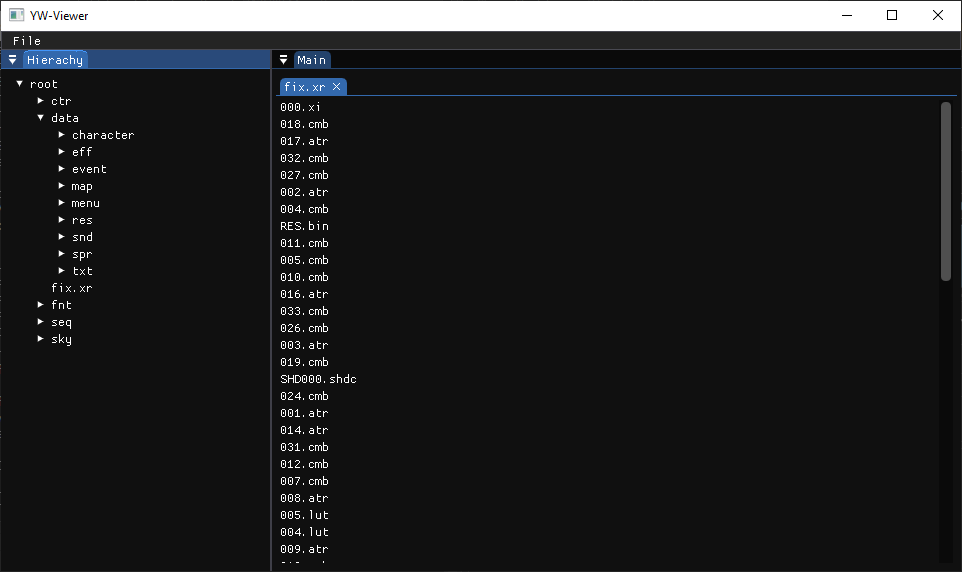

# Step 1: YW-Viewer
A software to open game files. Currently focusing on YW1 3DS, formats from newer games or newer platforms may not work.




# Planned Features
- Model Viewer
- Map Viewer
- Image Viewer
- Animated Image Viewer
- Font Viewer

# Build Requirements
- CMake
- C++ Compiler:
    - Windows: Visual Studio 2022 (or Later)
    - Linux/Other: Any should work

# Build Steps
```bash
cmake -B build
cmake --build build --config Release # or Debug
```

# Special Thanks
Thanks to the many contributors for their past works on Level-5 games to make this software possible:
- https://github.com/FanTranslatorsInternational/Kuriimu2
- https://github.com/Ploaj/Metanoia
- https://github.com/onepiecefreak3/CfgBinEditor
- https://github.com/onepiecefreak3/XtractQuery
- https://github.com/onepiecefreak3/Level5RessourceEditor
